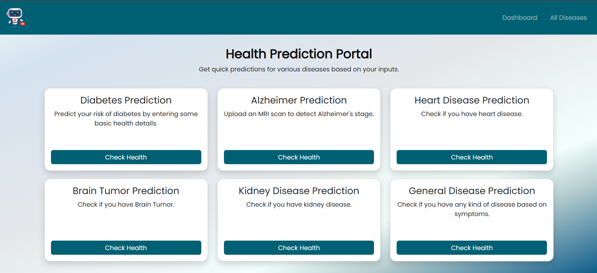

# 🏥 AI-Powered Disease Prediction System

Welcome to the **ML Based Disease Prediction System** – your virtual healthcare buddy!  
This project predicts a range of diseases based on User Inputs, Suggests Medicines, Diet plans & preutions and also features an **AI Talking Nurse** 🧑‍⚕️ that reads out the results for an interactive experience.

## 🚀 Features

- **Heart Disease Prediction** (Supervised ML)
- **Diabetes Prediction** (Supervised ML)
- **Kidney Disease Prediction** (Supervised ML)
- **Alzheimer's Disease Detection** (CNN-based Image Analysis)
- **Brain Tumor Detection** (CNN-based Image Analysis)
- **General Disease Prediction** (Based on Symptoms + Treatment Advice)

## 🛠️ Tech Stack

- **Frontend:**  
  - HTML5, CSS3, JavaScript  
  - Bootstrap 5  

- **Backend:**  
  - Python (Flask Framework)  
  - Machine Learning Models (Supervised Learning & CNNs)

- **Libraries/Tools:**  
  - Scikit-learn (for traditional ML models)  
  - TensorFlow / Keras (for CNNs)  
  - gTTS (Google Text-to-Speech)  
  - OpenCV, NumPy, Pandas  
  - Flask for server-side scripting and routing

## 🧠 How It Works

1. **User selects a disease category** through an intuitive card interface.
2. **Form inputs** are collected:
   - For structured prediction models: Health stats like Age, BP, Sugar levels, etc are taken.
   - For CNN models: Upload MRI scan images.
   - For general disease: Select symptoms from a dropdown list.
3. **Model predicts** the probability of disease.
4. **General disease module** also:
   - Suggests possible medicines 💊
   - Recommends Diet plans 🥗
   - Advises on necessary precautions ⚠️
5. **AI Talking Nurse** delivers the prediction and advice in a friendly, animated voice.

## 🧪 Models Brief

| Disease           | Model Type                   | Input               |
| :---------------- | :--------------------------- | :------------------ |
| Heart             | Decision tree Classifier     | Health Parameters   |
| Diabetes          | Random Forest Classifier     | Health Parameters   |
| Kidney            | Random Forest Classifier     | Health Parameters   |
| Alzheimer's       | CNN (Image Classification)   | MRI Scan            |
| Brain Tumor       | CNN (Image Segmentation & Classification) | MRI Scan |
| General Disease   | Random Forest Classification    | Symptoms Checklist  |

## 🎯 Future Enhancements

- Add Doctor consultation and appointment booking module.
- Integrate real-time chatbot for instant medical Q&A.
- Add authentication system for secure user data handling.
- Upgrade AI Talking Nurse to a fully interactive 3D avatar.
- Suggestions for Medical tests and Integratiion with Medical Shops.

## ✨ Demo
> _Dashboard_ 

> _Supervised Model Example (General Disease Predictor)_

> _CNN Model Example (Alzheimer Predictor)_  

## 📢 Note

This project is **FOR EDUCATIONAL PURPOSE ONLY** and not intended for real-world diagnosis or treatment. Always consult a healthcare professional!

## 📬 Contact

Made with ❤️ by Abhay Kushwaha  
LinkedIn Profile: https://www.linkedin.com/in/abhay-k-5a0902278/  
Email Address: abhay369kumar@gmail.com

---

# Stay Healthy, Stay Curious! 🚀